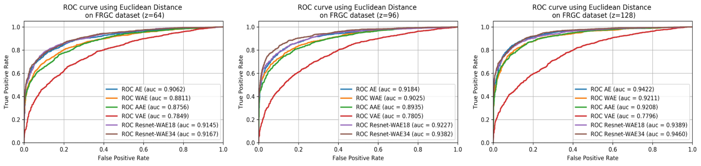

# Master-Thesis
This repository contains my thesis files including the codes and the papers. My thesis was related to feature extraction for face recognition system using autoencoder. In this thesis, I tried several autoencoder models such as variational autoencoder, adversarial autoencoder, and wasserstein autoencoder. We also did a little modification on wasserstein autoencoder by changing its network using residual network. We called this network as Resnet-WAE.
The autoencoder results for different latent dimension size are shown in the image below.

As we increase the network depth, we can see in the results below that the deeper the network is, the higher the accuracy results. This is because the deeper network can extract more features compare to the shallow network.

